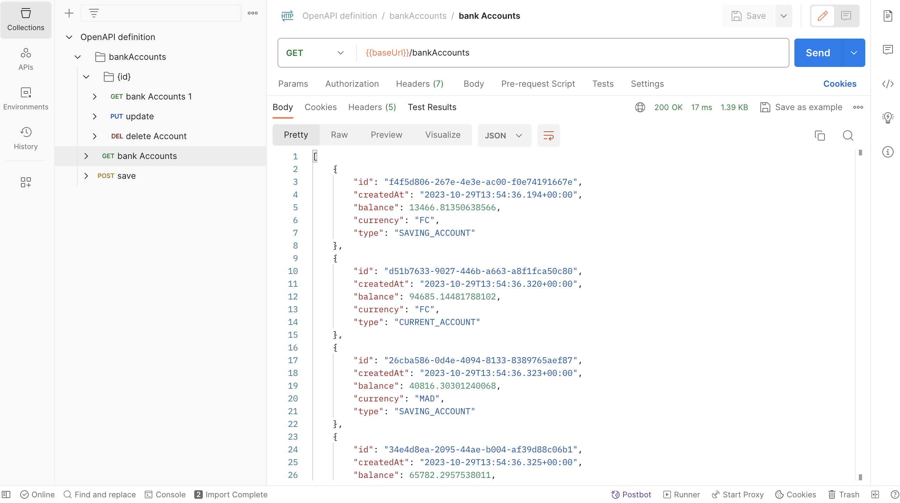
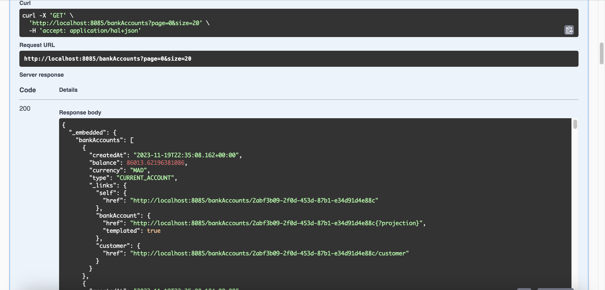
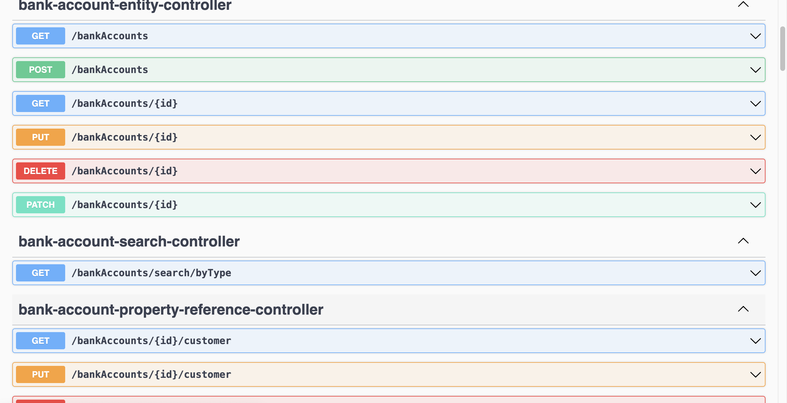
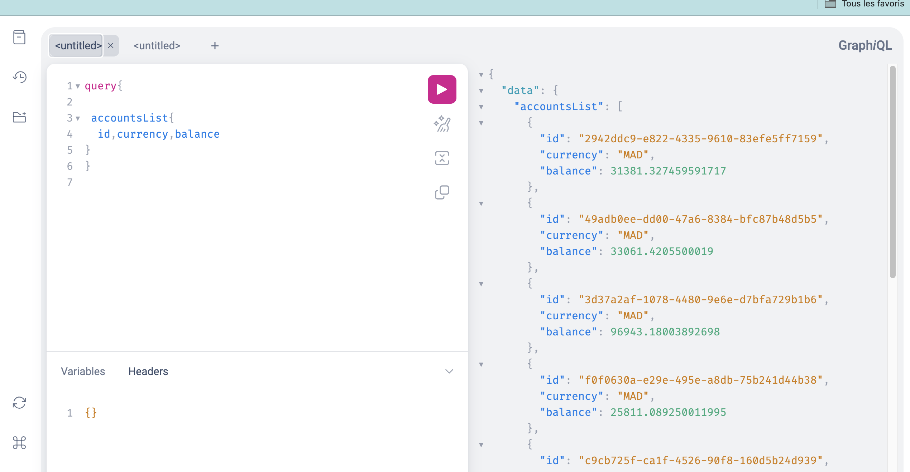
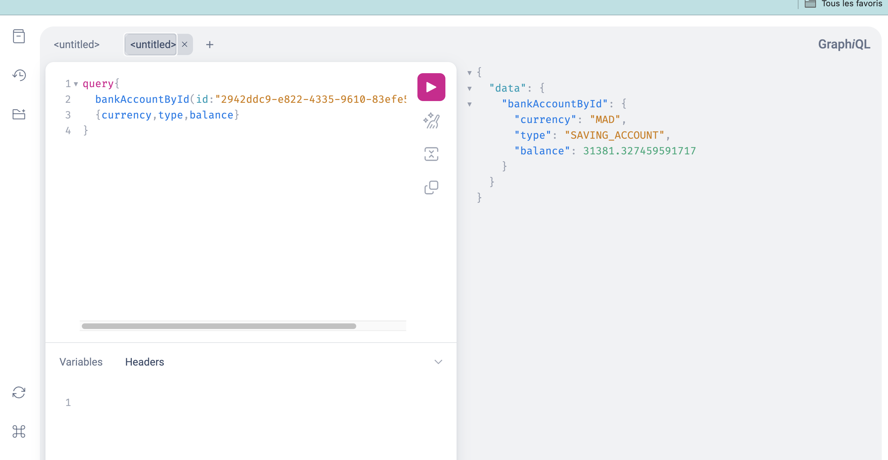
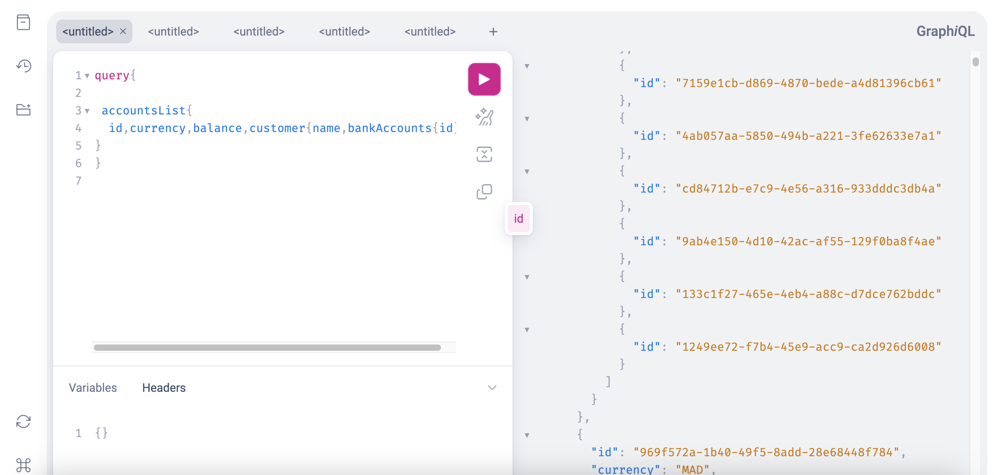
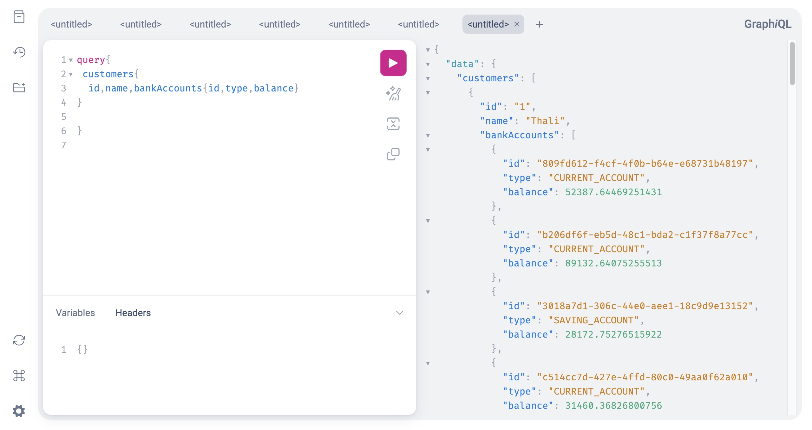
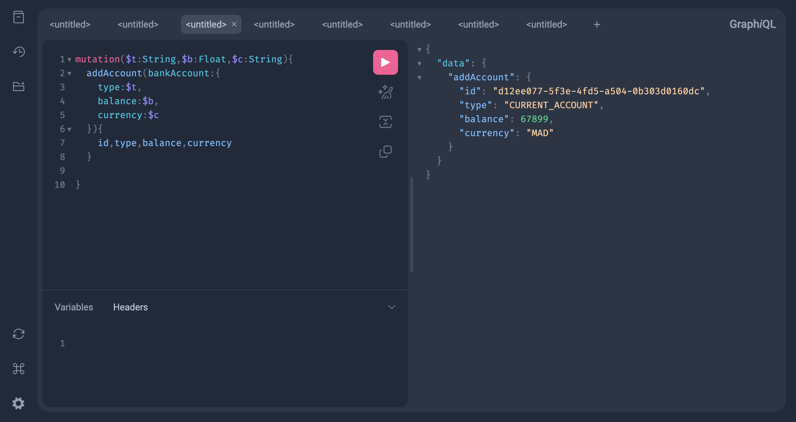
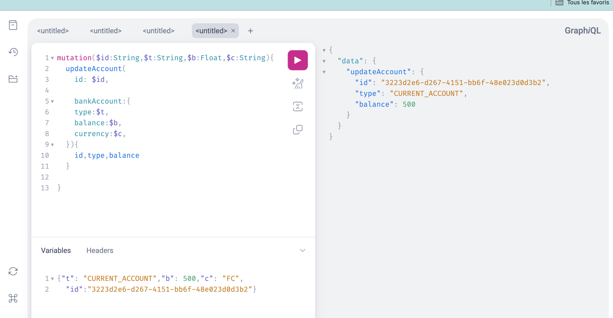
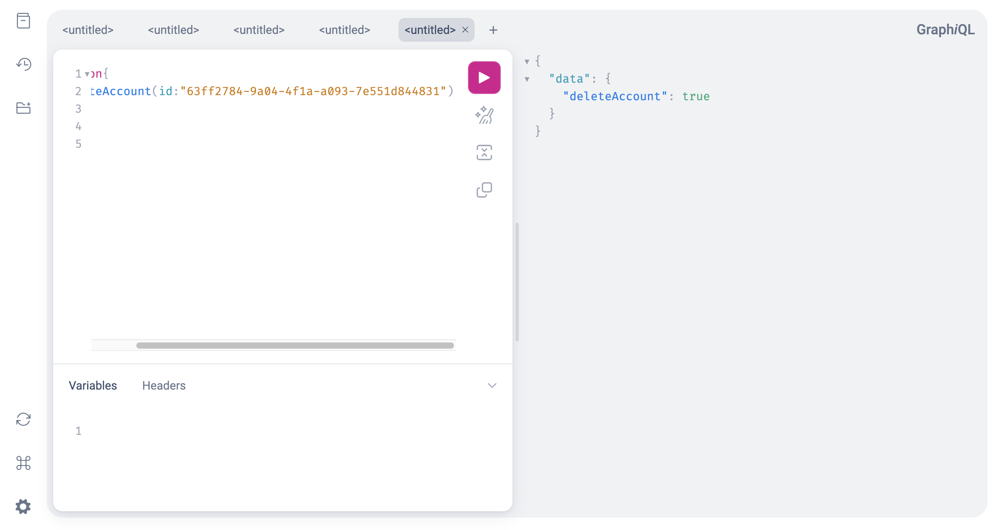

<h1>MICROSERVICE AVEC GRAPHQL & API Rest </h1>

<h1>REST</h1>

POSTMAN

Documentation Swagger

<h2>GraphQL </h2>
<h3>Query</h3>

Search customer by id

AcountList & Customer

Customer & BankAccount

AddAccount

Update

Delete

